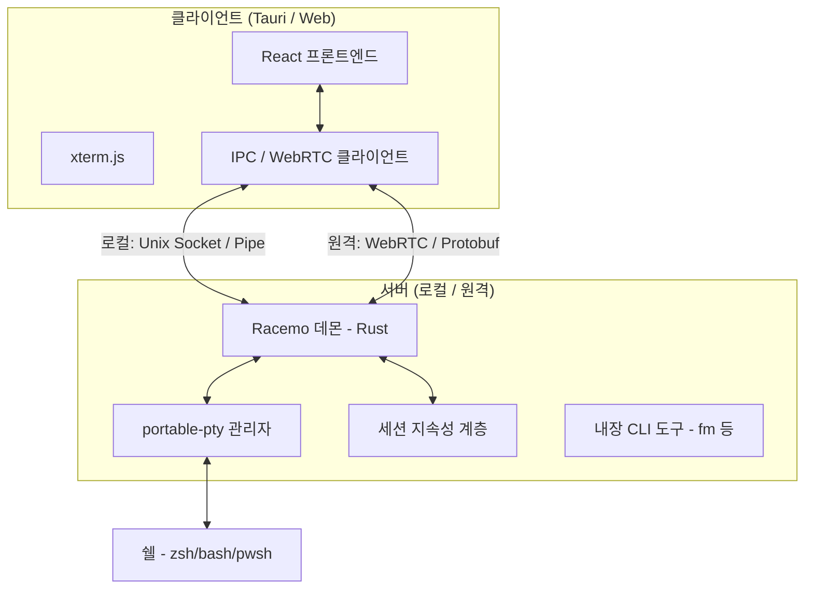

# Racemo 아키텍처

Racemo는 고가용성과 낮은 지연 시간을 위해 설계된 분산 클라이언트-서버 아키텍처를 따릅니다.

## 🏗️ 상위 수준 개요

## 🧩 구성 요소

### 1. Racemo 데몬 (`racemo-server`)
시스템의 핵심입니다. 백그라운드 프로세스(Tauri에서는 사이드카)로 실행되며 다음을 담당합니다:
- PTY(가상 터미널) 수명 주기 관리.
- 세션 상태 및 출력 버퍼 유지.
- 로컬 IPC 요청 처리.
- 원격 연결을 위한 WebRTC 호스트 역할 수행.

바이너리 소스: [src-tauri/src/bin/racemo_server.rs](src-tauri/src/bin/racemo_server.rs).

### 2. Tauri 클라이언트
GUI를 제공하는 데스크톱 애플리케이션입니다:
- **레이아웃 엔진**: 이진 트리 기반의 패널 시스템을 관리합니다.
- **터미널 렌더링**: 고성능 텍스트 출력을 위해 WebGL 기반의 `xterm.js`를 사용합니다.
- **통합**: 알림, 트레이 아이콘, 전역 단축키 등 OS 수준의 기능과 연결됩니다.

### 3. 시그널링 및 원격 P2P
원격 접속을 위해 Racemo는 P2P 연결을 돕는 별도의 시그널링 서버를 활용합니다:
- **시그널링**: WebRTC Offer/Answer를 교환하기 위한 가벼운 Rust 서버입니다 ([signaling-server/](signaling-server/)).
- **Protobuf**: 효율성을 극대화하기 위해 WebRTC 데이터 채널을 통해 Protocol Buffers로 메시지를 직렬화합니다.

## 📡 데이터 흐름

1. **입력(Input)**:
    - 사용자가 `xterm.js`에 입력 → 프론트엔드에서 캡처.
    - IPC(또는 WebRTC)를 통해 Racemo 데몬으로 전송.
    - 데몬이 해당 PTY의 입력 스트림에 기록.

2. **출력(Output)**:
    - 쉘이 PTY 출력에 기록.
    - 데몬이 PTY에서 데이터를 읽어 세션 버퍼를 업데이트하고 연결된 클라이언트들에 브로드캐스트.
    - 프론트엔드가 데이터를 수신하여 `xterm.js`를 통해 렌더링.

## 🔒 보안

- **로컬 IPC**: Unix 소켓 또는 Named Pipe에 대한 OS 수준의 파일 권한으로 보호됩니다.
- **원격 P2P**: WebRTC가 모든 데이터 채널에 대해 내장된 DTLS/SCTP 암호화를 제공합니다.
- **시그널링**: 오직 연결 핸드셰이크를 위해서만 사용되며, 터미널 데이터는 절대로 시그널링 서버를 통과하지 않습니다.
- 신뢰 모델 및 원격 호스트 보안 정책은 [SECURITY.md](SECURITY.md)를 참고하세요.

## 📁 주요 디렉터리

| 경로 | 역할 |
|---|---|
| [src/](src/) | React 프론트엔드 (TypeScript, xterm.js, zustand) |
| [src-tauri/](src-tauri/) | Tauri 쉘 + Rust 커맨드 레이어 + racemo-server 바이너리 |
| [signaling-server/](signaling-server/) | 원격 P2P를 위한 WebSocket 시그널링 서버 |
| [scripts/](scripts/) | 빌드/버전/설치 스크립트 |
| [tests/](tests/) | Playwright E2E 테스트 |

## 🤝 기여

개발 환경 세팅 및 기여 가이드는 [CONTRIBUTING.md](CONTRIBUTING.md)를 참고하세요.
