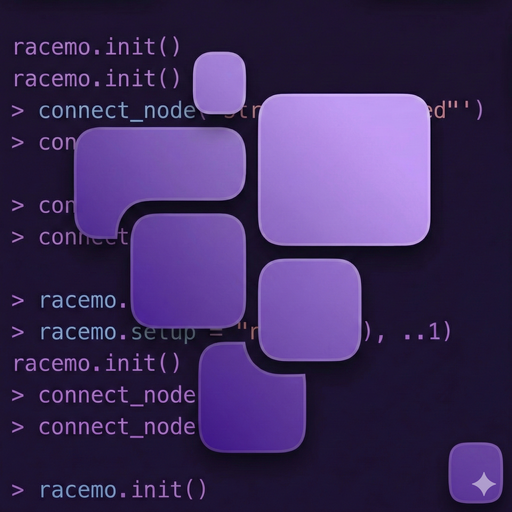
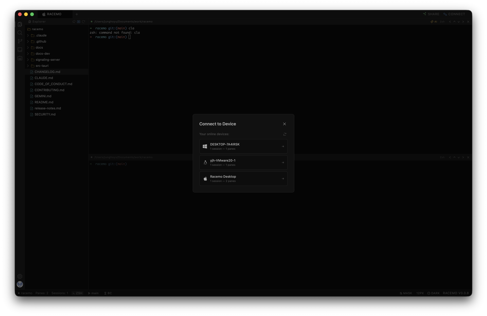
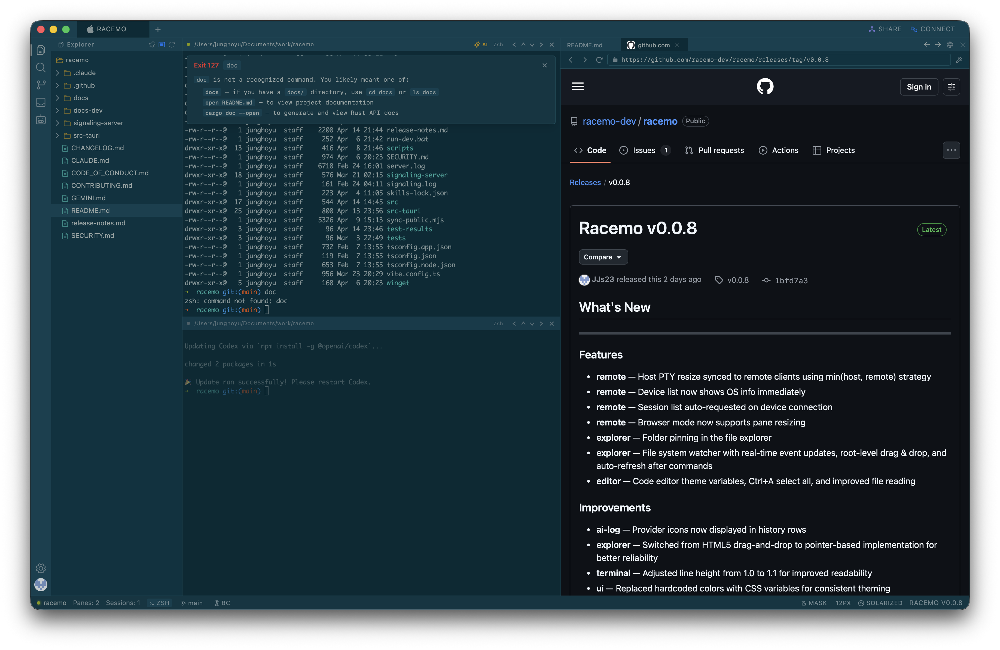
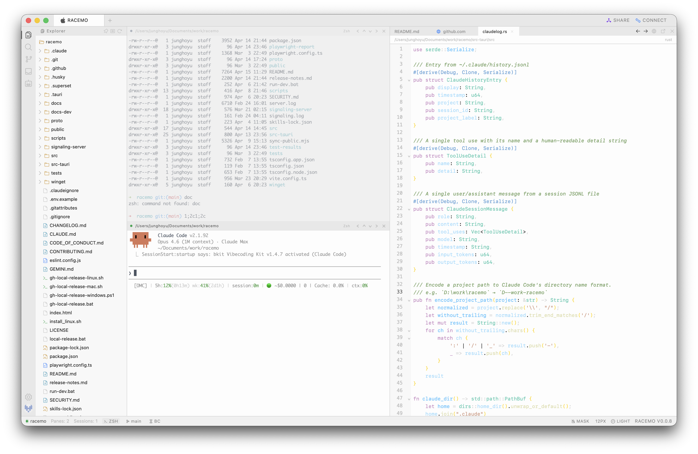
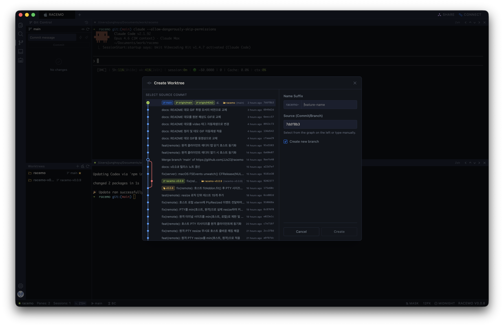
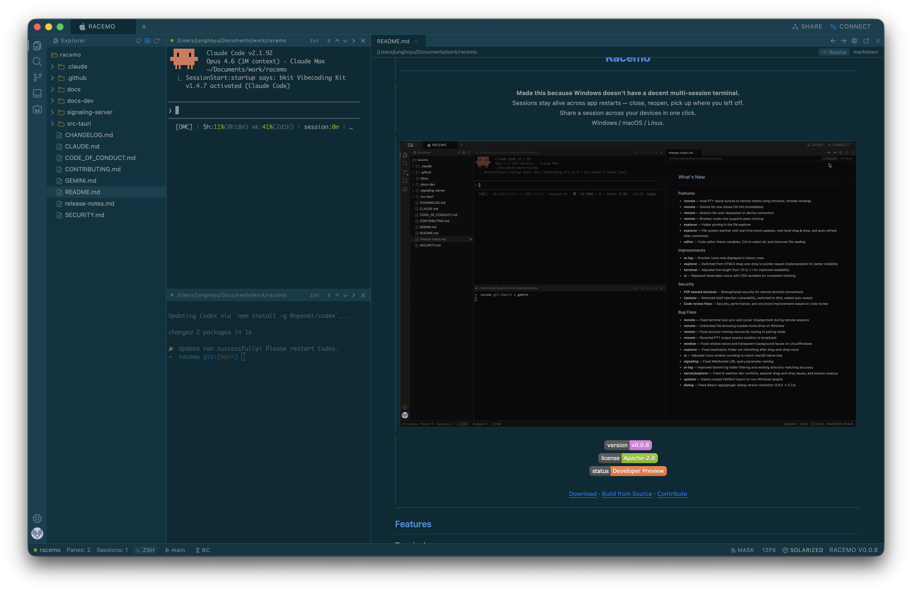

<p align="center">
  
</p>

<h1 align="center">Racemo</h1>

<p align="center">
  <strong>Pick up your terminal on another device — exactly where you left it.</strong><br/>
  Claude, Codex, Gemini, and OpenCode sessions travel with you.<br/>
  Windows · macOS · Linux — terminal data stays peer-to-peer.
</p>

<p align="center">
  
</p>

<p align="center">
  <a href="https://github.com/racemo-dev/racemo/actions/workflows/pr-check.yml"></a>
  <a href="https://github.com/racemo-dev/racemo/releases/latest"></a>
  <a href="LICENSE"></a>
  
  <br/>
  <a href="#install">Install</a> · <a href="#build-from-source">Build from Source</a> · <a href="docs/open-core.md">Open Core</a> · <a href="CONTRIBUTING.md">Contribute</a>
</p>

---

## Features

### Remote
- Share terminal across your devices via GitHub account (WebRTC P2P)
- One-click share from the title bar — no port forwarding, no SSH keys
- Signaling relay hosted by Racemo; all terminal data is peer-to-peer
- Persistent sessions travel with you — open the same session from any device

<p align="center">
  
</p>

> **Note:** Remote features use a hosted signaling relay (`racemo-signal.fly.dev`) for WebRTC connection setup. The signaling server is a closed-source hosted service and is not part of this repository. Terminal data after the initial handshake is fully peer-to-peer. Remote hosting assumes the peer is trusted; see [docs/open-core.md](docs/open-core.md), [docs/PROTOCOL.md](docs/PROTOCOL.md), and [SECURITY.md](SECURITY.md).

### AI
- Commit message generator — drafts a Conventional Commits message from your staged diff
- One-click AI commit — writes the message and commits in a single action
- Unified session history — browse Claude, Codex, Gemini, and OpenCode session logs side-by-side in a single timeline view

<p align="center">
  
</p>

### Terminal
- Multi-pane layout with horizontal/vertical splitting and drag-to-resize
- Multiple tabs with quick switching (`Alt+1~9`)
- Multi-pane broadcast — type once, send keystrokes to every pane at the same time (`Cmd+B`)
- Command palette (`Cmd+K`) and history search (`Cmd+R`)
- Shell autocomplete and command snippets with `{{variable}}` placeholders — save `ssh {{user}}@{{host}}` once, reuse forever

<p align="center">
  
</p>

### Editor & Git
- Inline code editor with syntax highlighting
- Markdown viewer with source/wysiwyg toggle
- File explorer with search and file operations
- Git staging, diff viewer, branch management

<p align="center">
  
  
</p>

### Privacy & Customization
- Secret masking for API keys and tokens (`Cmd+Shift+M`)
- Multiple built-in themes (light / dark / custom)
- Configurable fonts, UI scale, and default shell

## Install

### macOS

```bash
curl -fsSL https://raw.githubusercontent.com/racemo-dev/racemo/main/install_mac.sh | sh
```

### Windows

```cmd
powershell -c "irm https://raw.githubusercontent.com/racemo-dev/racemo/main/install_windows.ps1 | iex"
```

### Linux

```bash
curl -fsSL https://raw.githubusercontent.com/racemo-dev/racemo/main/install_linux.sh | sh
```

Or download directly from the [Releases](https://github.com/racemo-dev/racemo/releases/latest) page.

All platforms include automatic updates.

## Comparison

| | tmux / screen | iTerm2 / Windows Terminal | cmux | **Racemo** |
|---|---|---|---|---|
| Persistent sessions | CLI only | No | Workspace-based | Yes — daemon keeps PTY alive |
| Cross-platform | Linux / macOS | Single OS | macOS only | Windows / macOS / Linux |
| GUI pane management | Keyboard only | Basic | Yes (vertical + horizontal) | Yes |
| Built-in editor & git | No | No | No | Yes |
| AI session integration | No | No | Agent-native (Claude Code) | Unified log view (Claude / Codex / Gemini / OpenCode) |
| Remote access | SSH required | No | SSH | P2P WebRTC via hosted relay |

## Keyboard Shortcuts

> `Cmd` on macOS, `Ctrl` on Windows/Linux.

| Shortcut | Action |
|----------|--------|
| `Cmd+T` | New tab |
| `Cmd+Q` | Close active tab |
| `Cmd+B` | Toggle broadcast mode |
| `Cmd+K` | Command palette |
| `Cmd+R` | History search |
| `Cmd+F` | Search |
| `Cmd+Shift+E` | Toggle Explorer sidebar |
| `Cmd+Shift+F` | Toggle Search sidebar |
| `Cmd+Shift+G` | Toggle Source Control sidebar |
| `Cmd+Shift+H` | Toggle AI History sidebar |
| `Cmd+Shift+L` | Toggle AI Logs sidebar |
| `Cmd+,` | Open Settings |
| `Cmd+Shift+M` | Toggle secret masking |
| `Cmd+=` / `Cmd+-` / `Cmd+0` | Font size |
| `Alt+1~9` | Switch to tab by index |

## Architecture

```
┌─────────────────────────────────────────────┐
│              React + xterm.js               │  Frontend (TypeScript)
├─────────────────────────────────────────────┤
│              Tauri IPC Bridge               │  Commands & Events
├──────────────────────┬──────────────────────┤
│    Tauri App (Rust)  │  racemo-server (Rust)│  Two binaries
│    GUI + Commands    │  PTY + Sessions      │
├──────────────────────┴──────────────────────┤
│     Unix Socket / Named Pipe (MsgPack)      │  IPC Protocol
├─────────────────────────────────────────────┤
│          OS PTY (posix / ConPTY)            │  Platform Layer
└─────────────────────────────────────────────┘
```

More detail:
- [docs/architecture.md](docs/architecture.md) - client architecture and runtime boundaries
- [docs/open-core.md](docs/open-core.md) - what is open-source vs managed
- [docs/PROTOCOL.md](docs/PROTOCOL.md) - remote protocol and trust model
- [docs/FAQ.md](docs/FAQ.md) - common questions about hosting, security, and licensing

## Build from Source

### Prerequisites

- Node.js 20+
- Rust 1.75+
- Platform-specific Tauri v2 dependencies ([see Tauri docs](https://v2.tauri.app/start/prerequisites/))

### Steps

```bash
git clone https://github.com/racemo-dev/racemo.git
cd racemo
npm ci                  # Install dependencies (lockfile-based)
npm run tauri:dev       # Development mode
npm run tauri:build     # Production build
```

`npm run tauri:dev` starts the Vite dev server on port `5173`. If that port is already in use, stop the existing process or update the Vite dev server port and the matching Tauri `devUrl` in `src-tauri/tauri.conf.json`.

## Roadmap

- [ ] **Telegram integration** — session notifications and remote commands via Telegram bot
- [ ] Image viewer and PDF preview in the editor panel
- [ ] Process manager — highlight dev server ports, one-click kill
- [ ] Prompt-to-prompt jump & command separator with execution time
- [ ] Exit code badge (success/failure at a glance)

See [docs/roadmap.md](docs/roadmap.md) and [Issues](https://github.com/racemo-dev/racemo/issues) for detailed plans and discussion.

## Contributing

See [CONTRIBUTING.md](CONTRIBUTING.md) before opening a pull request.

## License

[Apache License 2.0](LICENSE)

---

<p align="center">
  <sub>Built with Rust + Tauri + xterm.js</sub>
</p>
